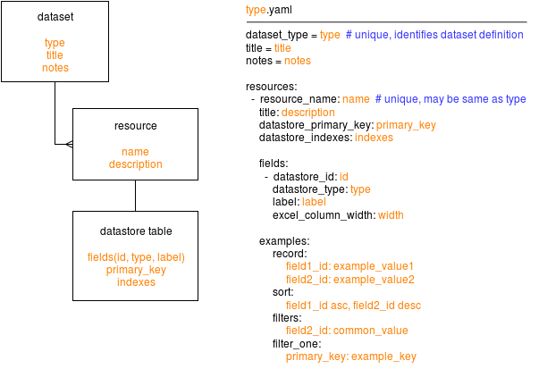

ckanext-recombinant
===================

This extension creates datasets and datastore tables for all
organizations in a ckan instance and allows combining the
data from all tables into a single CSV for exporting.

This lets us use CKAN's authentication to restrict users to
update only their organizations' tables but have all values
available as a single dataset for our public site.

Add this plugin to your CKAN configuration and link to the
table description file:

```ini
ckan.plugins = datastore recombinant

recombinant.tables = file:///.../mytables.yaml ...

#   module-path:file name may also be used, e.g:
#
# recombinant.tables = ckanext.atisummaries:recombinant_tables.json
#
#   will try to load "recombinant_tables.json" from the directory
#   containing the ckanext.atisummaries module
```


Datasets and Dataset Definitions
--------------------------------



Supported Datastore Types
-------------------------

Each "fields" entry in the JSON table description file
describes a field in the dataset. In particular, its
"datastore_type" key codifies its type.

The ckanext-recombinant extension supports the following
data type specifications, with their respective semantics:

```"datastore_type": "text"```
The field is a text value, corresponding to a text column
in the database. It takes no specific input format in
the .xls template. Such fields default to a blank unicode
string.

```"datastore_type": "int"```
The field is a numeric value, corresponding to an integer
column in the database. It takes a .xls template format
using space-separated digit groups; the execution
canonicalizes content to an integer on write. Such
fields default to zero.

```"datastore_type": "year"```
The field is a year value, corresponding to an integer
column in the database. It takes a .xls template format
citing a four digit integer; the execution canonicalizes
content to an integer on write. Such fields default to zero.

```"datastore_type": "month"```
The field is a month value, corresponding to an integer
column in the database. It takes a .xls template format
citing a two digit integer, left-zero-padded; the execution
canonicalizes content to an integer on write. Such fields
default to zero.

```"datastore_type": "date"```
The field is a date value, corresponding to a text
column in the database. It takes a .xls template format
specifying an ISO 8601 date (yyyy-mm-dd). Such fields
default to a blank unicode string.

```"datastore_type": "money"```
The field is a text value, corresponding to a text
column in the database. It takes a xls template template
format specifying a dollar sign ('$') prefix and space-
separated digit groups; the execution reduces content
to an integral numeric string on write. Such fields
default to a blank unicode string.
