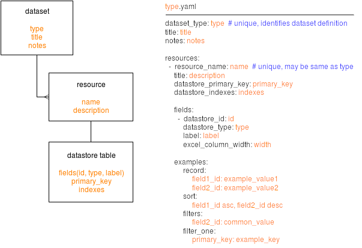

# CKANEXT Recombinant

[](https://github.com/open-data/ckanext-recombinant/actions/workflows/test.yml)

[](https://codecov.io/github/open-data/ckanext-recombinant)

| Table of Contents    |
| -------- |
| [Overview](#overview)  |
| [Requirements](#requirements) |
| [Installation](#installation)    |
| [Definitions](#definitions)    |
| [Datastore Types](#datastore-types)    |

## Overview

This extension creates datasets and datastore tables for all organizations in a ckan instance and allows combining the data from all tables into CSVs for exporting.

This lets us use CKAN's authentication to restrict users to update only their organizations' tables but have all values available as a single dataset for our public site.

Recombinant provides template excel files for end users to bulk import or update data. It also provides a form to delete individual rows that have been imported.

## Requirements

Compatibility with core CKAN versions:

| CKAN version    | Compatible?   |
| --------------- | ------------- |
| 2.6 and earlier | no    |
| 2.7             | no    |
| 2.8             | no    |
| 2.9             | no    |
| 2.10             | yes    |
| 2.11             | no    |

Compatibility with Python versions:

| Python version    | Compatible?   |
| --------------- | ------------- |
| 2.7 and earlier | no    |
| 3.7 and later            | yes    |

Required extensions:

* `datastore`

## Installation

Add this plugin to your CKAN configuration and link to your recombinant definition files:

```ini
ckan.plugins = datastore recombinant

recombinant.definitions = file:///.../type1.yaml ...

# module-path:file name may also be used, e.g:
#
# recombinant.definitions = ckanext.atisummaries:ati.yaml
#
# will try to load "ati.yaml" from the directory
# containing the ckanext.atisummaries module
```

## Definitions

### Table Definitions



Recombinant definitions control the behaviour of this extension. Dataset types are registered using an IDatasetForm plugin and must be unique across the CKAN instance.

Resource names are used to identify Excel sheets being imported and must be unique across the CKAN instance. Resource names are often the same as the dataset type when only a single resource is present in a definition.

The `ckan -c <INI> recombinant create` command will create or update datasets for every organization to match the definition for its type, including updating fields, resources and creating or updating datastore table fields, primary keys and indexes.

Examples provided will be used to generate API documentation for end users.

***For expansive examples,*** you can see the Canadian Data Portal definitions [here.](https://github.com/open-data/ckanext-canada/tree/master/ckanext/canada/tables)

#### DataStore Primary Keys

`datastore_primary_key` *(required)*
* Specifies the primary key(s) to be used in the DataStore table.
  ```yaml
  datastore_primary_key: field_1
  ```
  OR
  ```yaml
  datastore_primary_key: [field_1, field_2]
  ```

#### Database Triggers

`triggers` *(required)*
* Specify the triggers that execute on each row in the database table. These are considered the backend validation.

### Field Definitions

#### DataStore ID

`datastore_id` *(required)*
* Sepecifies the database column name (a.k.a datastore field name). This must be unique in the resource. Must be a string.
  ```yaml
  datastore_id: example_field
  ```

#### Label

`label` *(required)*
* Specifies the label for the field. String or Dict[str, str]
  ```yaml
  label: Example Field
  ```
  OR
  ```yaml
  label:
    en: Example Field (English)
    fr: Example Field (en français)
  ```

#### Description

`description` *(required)*
* Specifies the description for the field. String or Dict[str, str]
  ```yaml
  description: >
    Field description
  ```
  OR
  ```yaml
  description:
    en: >
      Field description(English)
    fr: >
      Field description (en français)
  ```

#### Obligation

`obligation` *(required)*
* Specifies a human readable definition of the requirement of the field. String or Dict[str, str]
  ```yaml
  obligation: Optional
  ```
  OR
  ```yaml
  obligation:
    en: Required if another field is not zero (English)
    fr: Required if another field is not zero (en français)
  ```

#### Excel Required

`excel_required` *(required)*
* Specifies if the field is required in Excel Forms.

#### Form Required

`form_required` *(optional)*
* Specifies if the field is required in Web Forms.

#### Validation

`validation` *(required)*
* Specifies a human readable definition of the validation for the field. String or Dict[str, str]
  ```yaml
  obligation: This field must not be empty.
  ```
  OR
  ```yaml
  obligation:
    en: This field must not be empty.
    fr: Ce champ ne doit pas être vide.
  ```
  OR
  ```yaml
  obligation: |
    This field must not be empty.
    The value cannot be less than zero.
  ```

#### Occurence

`occurrence` *(required)*
* Specifies a human readable deinition to the recurrence of the field value. This is generally useful to `_text` type fields.
  ```yaml
  occurrence: Single
  ```
  OR
  ```yaml
  occurrence:
    en: Repeatable (English)
    fr: Repeatable (en français)
  ```

#### Format Type

`format_type` *(required)*
* Specifies a human readable definition of the format for the field value.
  ```yaml
  format_type: Free text
  ```
  OR
  ```yaml
  format_type:
    en: City specified as City, Province, County (English)
    fr: City specified as City, Province, County (en français)
  ```

#### DataStore Type

`datastore_type` *(required)*
* Specifies the postgres datatype for the field. See [Datastore Types](#datastore-types) below.
  ```yaml
  datastore_type: _text
  ```

#### Choices File

`choices_file` *(optional)*
* Specifies the YAML or JSON file to be used for select/multi-select.
  ```yaml
  choices_file: path/to/choices.yaml
  ```

#### Choices

`choices` *(optional)*
* Instead of specifying a `choices_file`, this specifies the choices directly in the field definition. Dict[str, str] or Dict[str, Dict[str, str]]
  ```yaml
  choices:
      value_1: Label for Value One
  ```
  OR
  ```yaml
  choices:
      value_1:
        en: Label for Value One (English)
        fr: Label for Value One (en français)
  ```

#### Excel Full Text Choices

`excel_full_text_choices` *(optional)*
* Specifies whether or not to display the values AND labels in Excel select boxes. Boolean, defaults to False.
  ```yaml
  excel_full_text_choices: true
  ```

#### Form Choices Prefix Code

`form_choices_prefix_code` *(optional)*
* The same as `excel_full_text_choices` but for Web Forms. Boolean, defaults to False.
  ```yaml
  form_choices_prefix_code: true
  ```

#### Excel Error Formula

`excel_error_formula` *(optional)*
* Specifies the Excel formula to use when calculating errors in Excel for the field's cells. You should always use `default_formula` in it.
  ```yaml
  excel_error_formula: OR({default_formula},{cell}<0)
  ```

#### Excel Required Formula

`excel_required_formula` *(optional)*
* Specifies the Excel formula to use when calculating required errors in Excel for the field's cells.
  ```yaml
  excel_required_formula: NOT(ISBLANK({another_field}))
  ```

#### Max Characters

`max_chars` *(optional)*
* Specifies the maximum number of characters for the field. Integer.
  ```yaml
  max_chars: 50
  ```

#### Visible to Public

`visible_to_public` *(optional)*
* Specifies whether or not the field is visible and editable in Excle Forms and Web Forms. Boolean, defaults to True.
  ```yaml
  visible_to_public: false
  ```

#### Import Template Include

`import_template_include` *(optional)*
* Specifies whether or not the field should be imported into the database when loading an Excel file. Boolean, defaults to True.
  ```yaml
  import_template_include: false
  ```

#### Published Resource Computed Field

`published_resource_computed_field` *(optional)*
* Specifies if the field is a dynamically calculated field or not. If it is, it will be excluded from Excel Forms, Web Forms, and the DataStore table. Boolean, defaults to False.
  ```yaml
  published_resource_computed_field: true
  ```

## Datastore Types

Each "fields" entry in the JSON table description file describes a field in the dataset. In particular, its "datastore_type" key codifies its type.

The ckanext-recombinant extension supports the following data type specifications, with their respective semantics:

```"datastore_type": "text"```
* The field is a text value, corresponding to a text column in the database. It takes no specific input format in the .xls template. Such fields default to a blank unicode string.

```"datastore_type": "_text"```
* The field is a text array value, corresponding to a text[] column in the database. It takes no specific input format in the .xls template. Such fields default to null.

```"datastore_type": "int"```
* The field is a numeric value, corresponding to an integer column in the database. It takes a .xls template format using space-separated digit groups; the execution canonicalizes content to an integer on write. Such fields default to zero.

```"datastore_type": "year"```
* The field is a year value, corresponding to an integer column in the database. It takes a .xls template format citing a four digit integer; the execution canonicalizes content to an integer on write. Such fields default to zero.

```"datastore_type": "month"```
* The field is a month value, corresponding to an integer column in the database. It takes a .xls template format citing a two digit integer, left-zero-padded; the execution canonicalizes content to an integer on write. Such fields default to zero.

```"datastore_type": "date"```
* The field is a date value, corresponding to a text column in the database. It takes a .xls template format specifying an ISO 8601 date (yyyy-mm-dd). Such fields default to a blank unicode string.

```"datastore_type": "money"```
* The field is a text value, corresponding to a text column in the database. It takes a xls template template format specifying a dollar sign ('$') prefix and space-separated digit groups; the execution reduces content to an integral numeric string on write. Such fields default to a blank unicode string.
